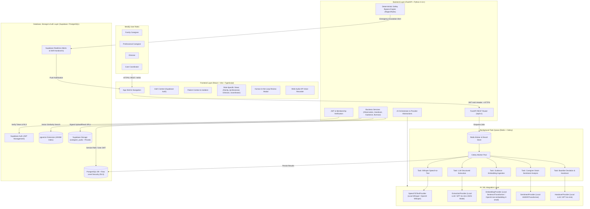
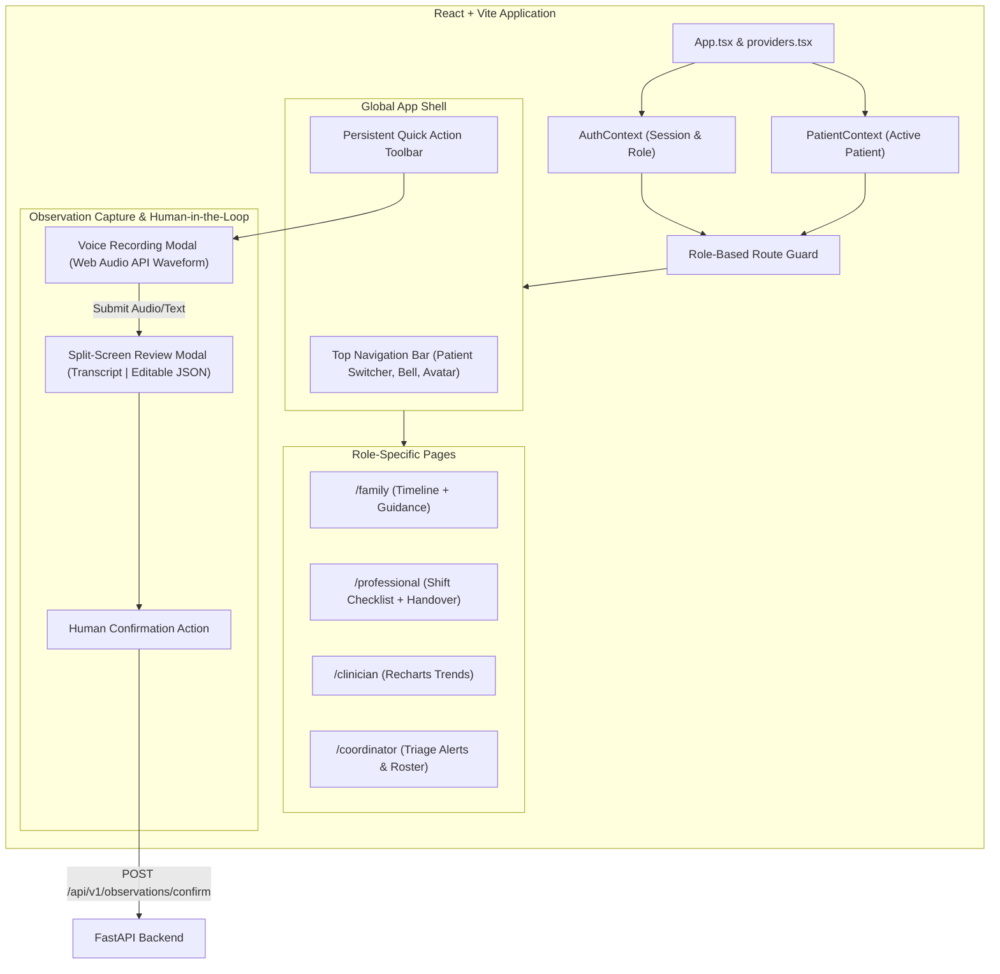
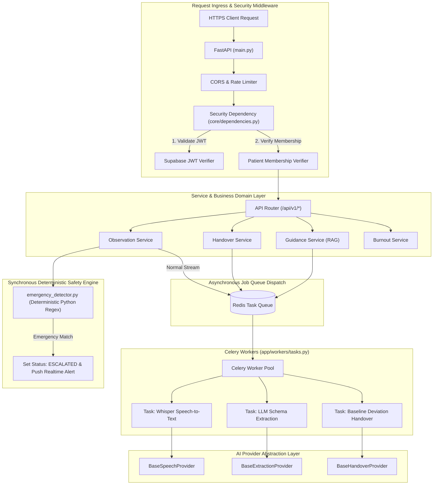
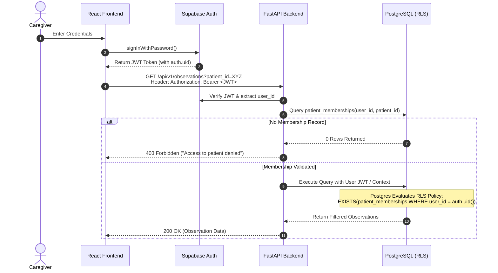
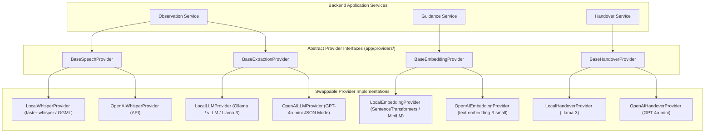
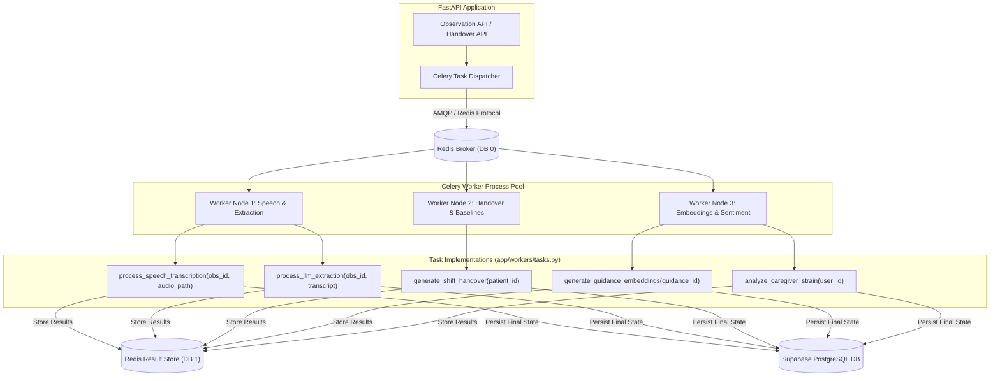
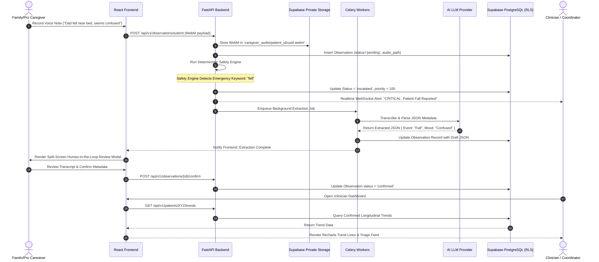

# MediQ — System Architecture Document

## Executive Summary & Overview

**MediQ** is an AI-powered caregiver coordination and burnout-prevention platform designed to connect family caregivers, professional nurses, clinicians, and care coordinators around a single, unified longitudinal patient record.

The platform provides:
- Voice and text observation logging with Web Audio API capture.
- Whisper speech-to-text transcription and Pydantic-constrained LLM structured metadata extraction.
- **Human-in-the-Loop (HITL)** split-screen review and confirmation modal.
- **Deterministic Safety Bypass Engine** operating independently of AI to detect critical emergencies (falls, stroke, choking).
- **Smart Shift Handovers** with baseline deviation calculations and prioritized watch items.
- **Non-punitive Caregiver Burnout Engine** monitoring strain signals in strict privacy.
- **RAG Clinical Guidance Search** backed by Supabase `pgvector` HNSW indexes.

---

## 1. Overall System Architecture



---

## 2. Frontend Architecture



---

## 3. Backend Architecture



---

## 4. Authentication & RLS Sequence



---

## 5. Observation Processing & Human-in-the-Loop Flow

```mermaid
flowchart TD
    Start(["Caregiver Ingests Observation (Voice WebM or Text)"]) --> UploadFE["Frontend: Captures Payload & Validates Size/Type"]
    UploadFE --> APIPost["POST /api/v1/observations/submit"]

    APIPost --> VerifyAuth["FastAPI: Authenticate User & Validate Patient Membership"]
    VerifyAuth --> CheckAudio{"Is Audio File Provided?"}

    CheckAudio -- Yes --> StoreAudio["Upload to Supabase Storage: 'caregiver_audio' (Private Bucket)"]
    StoreAudio --> SavePendingAudio["Insert Observation Record (status = 'pending', audio_path)"]
    CheckAudio -- No --> SavePendingText["Insert Observation Record (status = 'pending', raw_text)"]

    SavePendingAudio --> TriggerSafety["Execute Deterministic Python Safety Engine (Regex/Rules)"]
    SavePendingText --> TriggerSafety

    TriggerSafety --> EmergencyCheck{"Critical Emergency Keyword Match?<br/>(fall, stroke, choking, unconscious)"}

    EmergencyCheck -- YES (Emergency Detected) --> EscalateState["Mark Record: status = 'escalated', priority = 100"]
    EscalateState --> RealtimeAlert["Broadcast Emergency Alert via Supabase Realtime Bus"]
    RealtimeAlert --> FastNotify["Push Urgent UI Banner to Coordinator & Care Team"]

    EmergencyCheck -- NO (Normal Path) --> EnqueueJob["Enqueue Celery Background Job (Worker A)"]

    subgraph AsyncWorkerA ["Worker A Task Execution"]
        EnqueueJob --> WhisperSTT{"If Audio: Call Whisper SpeechToTextProvider"}
        WhisperSTT --> TranscriptResult["Generate Verbatim Transcript"]
        TranscriptResult --> LLMExtraction["Call LLM ExtractionProvider (Pydantic JSON Mode Schema)"]
        LLMExtraction --> StructuredJSON["Output Metadata: Mood, Sleep, Appetite, Symptoms, Notes"]
    end

    StructuredJSON --> UpdateObsDraft["Update Observation Record with Draft Extracted JSON"]
    UpdateObsDraft --> NotifyFE["Notify Frontend: Extraction Ready for Review"]

    NotifyFE --> HitlModal["Frontend Displays Split-Screen Review Modal"]
    subgraph HitlReview ["Human-in-the-Loop Confirmation"]
        HitlModal --> LeftSide["Left Column: Verbatim Audio Transcript"]
        HitlModal --> RightSide["Right Column: Editable Metadata Dropdowns & Notes"]
        RightSide --> CaregiverEdit["Caregiver Modifies / Corrects Any Errors"]
        CaregiverEdit --> UserConfirm["Caregiver Clicks 'Confirm & Save'"]
    end

    UserConfirm --> APIConfirm["POST /api/v1/observations/{id}/confirm"]
    APIConfirm --> FinalCommit["Update DB Record: status = 'confirmed', final_metadata"]
    FinalCommit --> End(["Observation Sealed in Longitudinal Record"])
```



---

## 6. AI Provider Abstraction Architecture



---

## 7. RAG / pgvector Flow

```mermaid
flowchart TD
    subgraph Ingestion ["1. Guidance Document Ingestion Pipeline"]
        DocInput["Approved Clinical Guidance Markdown/Text"] --> Chunker["Text Chunker (500 Token Chunks + 50 Overlap)"]
        Chunker --> EmbedGen["EmbeddingProvider (Generate Embeddings)"]
        EmbedGen --> InsertPG["Insert into clinical_guidance (content, metadata, embedding)"]
        InsertPG --> HNSWBuild["PostgreSQL HNSW Vector Indexing"]
    end

    subgraph Retrieval ["2. Similarity Retrieval Pipeline"]
        UserQuery["Caregiver Query (e.g. 'How to handle dementia agitation?')"] --> QueryEmbed["Generate Query Embedding Vector"]
        QueryEmbed --> VectorSearch["Execute pgvector Cosine Distance Query (<->)"]

        VectorSearch --> SQLQuery["SELECT id, title, content, 1 - (embedding <=> query_vec) AS similarity<br/>FROM clinical_guidance<br/>WHERE is_approved = TRUE<br/>ORDER BY embedding <=> query_vec LIMIT 5;"]

        SQLQuery --> FilteredResults["Retrieve Top-K Approved Care Tips"]
        FilteredResults --> FERender["Display Grounded Care Guidance in UI"]
    end
```



---

## 8. Background Task Queue (Redis + Celery)



---

## 9. Security Architecture

```mermaid
graph TD
    subgraph ClientTrustBoundary ["Untrusted Client Boundary"]
        Browser["User Browser / React App"]
        NoSecrets["Strict Rule: NO Service Keys, NO API Secrets in JS Bundle"]
    end

    Browser -->|TLS 1.3 / HTTPS| NetworkEdge["Cloudflare / Network Edge Security"]

    subgraph NetworkEdge ["Edge Security Layer"]
        NetworkEdge --> DDoS["DDoS Mitigation"]
        NetworkEdge --> WAF["Web Application Firewall (WAF)"]
        NetworkEdge --> RateLimiter["API Rate Limiting (100 req/min per IP)"]
    end

    RateLimiter --> BackendEntry["FastAPI Application Gateway"]

    subgraph BackendSecurity ["Backend Authorization Layer"]
        BackendEntry --> ValidateJWT["Decode Supabase JWT Signature"]
        ValidateJWT --> CheckMembership["Query patient_memberships Table"]
        CheckMembership --> InputSanitize["Pydantic Input Sanitization & Type Validation"]
    end

    InputSanitize --> DBBoundary["PostgreSQL Database Gatekeeper"]

    subgraph DatabaseSecurity ["Database & Storage Security"]
        DBBoundary --> RLSCheck["PostgreSQL Row Level Security Policy Evaluation"]
        RLSCheck --> StorageBucket["Private Storage Bucket (Signed URLs ONLY - 15min expiry)"]
    end
```

---

## 10. Complete End-to-End Data Flow



---

## 11. Security & Production Hardening

- **Zero Client Secrets:** The React bundle includes only public Supabase Anon keys. Service keys remain strictly on the backend.
- **Strict Row Level Security:** Every query executed against PostgreSQL is constrained by explicit membership policies (`patient_memberships`).
- **Private Audio Storage:** Audio files stored in `caregiver_audio` bucket are unreadable publicly. Access is gated by backend signed URLs with 15-minute expiration times.
- **Non-punitive Burnout Logs:** Caregiver strain scores in `burnout_logs` are locked to the user ID. Supervisors cannot query individual strain scores.
